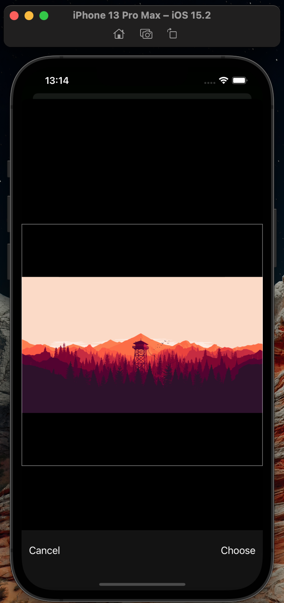
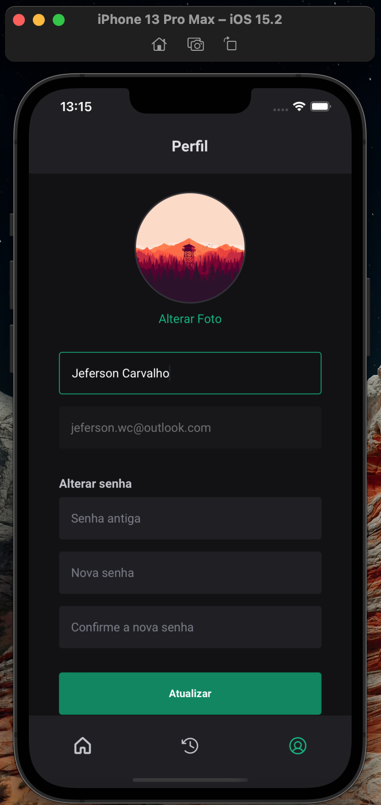

# GYM App - React Native

<p align="center">
  
</p>

## Description

"GYM App" is a React Native app powered by Expo that allows users to manage their fitness activities at the gym. It is the ideal application for those who exercise daily and want to follow their progress.

## Installation

To install and run the app locally, please follow these steps:

Clone the repository:

```bash
git clone https://github.com/jefersonwillian/iginite-rn-03-gym.git
```

Enter the project folder:

```bash
 cd iginite-rn-03-gym
```

Install the dependencies:

```bash
npm install
```

Start the development server:

```bash
expo start
```

Run the app on an emulator or physical device using one of the following commands:
Follow the instructions in the Expo Developer Tools to run the app on an emulator or physical device.

```bash
expo android
```

or

```bash
expo ios
```

## Usage

When the application is running, you first need to register to access the workouts. We have a specific screen to carry out this registration. After registering, log in to the application. You will be redirected to the home page, where we will have a list of exercises with filter options by type of exercise. In addition, we have the history screen, where you can follow the entire history of the exercises performed. And then there's the profile screen, where you can change your registration information.

When clicking on a physical activity, a modal will open with details on how to perform that activity. You will be able to mark that exercise as completed and you will be redirected to the history screen.

## Screens

<p align="center">
    
    
    
</p>

<p align="center">
    
    
    
</p>

<p align="center">
    
    
    
</p>

<p align="center">
    
    
    
</p>

## About the project

This app was developed using Expo. In addition, we use Native Base to speed up the creation and styling of pages within the application. We use Yup for form validation and React Hook Form to control forms within the project.

The application saves some user information in storage, such as the token and refresh token. It also saves ID, name, email and avatar. We created a context that shares all user information to the project, so we can retrieve that information anywhere in the project.

We integrated with the API using Axios and created an interceptor in all requests to validate the access token and check the need to update this token when it expires. In addition, the project has other resources, such as components, theme, DTOs and hooks.

There are many other things that were created in the project. Feel free to review the project code

## Contributing

If you would like to contribute to this project, please open an issue or submit a pull request. All contributions are welcome!

## License

This project is licensed under the MIT license. See the LICENSE file for more details.

## Author

`GYM App` was developed by Jeferson Carvalho.
